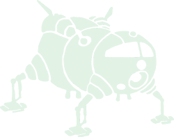

# StarBugII




## PSF photometry in complex and crowded fields

&emsp; • Detect deeply dust-embedded sources in NIRCam and MIRI images

&emsp; • Full suite of photometry tools

&emsp; • Powerful modular and simple GNU Linux standard command line interface


<br clear="left"/>

[](https://github.com/conornally/starbug2/actions/workflows/python-app.yml)
[](https://pypi.python.org/pypi/starbug2/)
[](https://github.com/conornally/starbug2/releases)
[](https://starbug2.readthedocs.io/en/latest/?badge=latest)
[](https://ascl.net/2309.012)


## Installation

*StarbugII* requires [webbpsf](https://webbpsf.readthedocs.io/en/latest/installation.html) installed on the system to function fully.

```bash
$~ pip install starbug2
$~ starbug2 --init
```
</br>

> [!IMPORTANT]
> If you make use of *StarbugII* in any published or presented work, please include a [citation](https://ui.adsabs.harvard.edu/abs/2023ascl.soft09012N/abstract).
> 
> *StarbugII* uses methods and datatypes from [astropy](https://docs.astropy.org/en/stable/) and [photutils](https://photutils.readthedocs.io/en/stable), please acknowledge them accordingly.

</br>

## Documentation

See the [full documentation](https://starbug2.readthedocs.io/en/latest/?badge=latest) for the complete installation and detailed guides to using the photometric routines.
Basic usage information is produced by running:

```bash
StarbugII - JWST PSF photometry
usage: starbug2 [-ABDfGhMPSv] [-b bgdfile] [-d apfile] [-n ncores] [-o ouput] [-p file.param] [-s opt=val] image.fits ...
   -A  --apphot          : run aperture photometry on a source list
   -B  --background      : run background estimation
   -b  --bgdfile         : load background (-bgd.fits) file
   -d  --apfile  ap.fits : load a source detection (-ap.fits) file to skip the source detection step
   -D  --detect          : run source detection
   -f  --find            : attempt to find associated -ap -bgd files
   -G  --geom            : calculate geometric stats on source list
   -h  --help            : display uasage information
   -M  --match           : match outputs from all input image files
   -n  --ncores      num : number of CPU cores to split process between
   -o  --output      dir : output directory
   -p  --param   a.param : load parameter file
   -P  --psf             : run psf photometry
   -s  --set      option : set value in parameter file at runtime (-s SIGSKY=3)
   -S  --subbgd          : subtract background from image
   -v  --verbose         : display verbose outputs

   --> Single run commands
       --init                     : Initialise Starbug (post install)
       --local-param              : Make a local copy of the default parameter file
       --update-param             : Update an out-of-date local parameter file
       --generate-psf             : Generate a single PSF. Set FILTER, DET_NAME, PSF_SIZE with -s
       --generate-region   a.fits : Make a ds9 region file with a detection file
       --generate-run      *.fits : Generate a simple run script
       --version                  : Print starbug2 version

       --apply-zeropint    a.fits : Apply a zeropoint (-s ZP_MAG=1.0) to a.fits
       --calc-instr-zp     a.fits : Calculate and apply an instrumental zero point onto a.fits

   --> typical runs
      $~ starbug2 -vD -p file.param image.fits      //Source detect on image with a parameter file
      $~ starbug2 -vDM -n4 images*.fits             //Source detect and match outputs of a list of images
      $~ starbug2 -vd image-ap.fits -BP image.fits  //PSF photometry on an image with a source file (image-ap.fits)

See https://starbug2.readthedocs.io for more information.
```

```bash
StarbugII Matching 
usage: starbug2-match [-BCGfhv] [-e column] [-o output] [-p file.param] [-s KEY=VAL] table.fits ...
    -B  --band               : match in "BAND" mode (does not preserve a column for every frame)
    -C  --cascade            : match in "CASCADE" mode (left justify columns)
    -G  --generic            : match in "GENERIC" mode

    -e  --error   column     : photometric error column ("eflux" or "stdflux")
    -f  --full               : export full catalogue
    -h  --help               : show help message
    -o  --output  file.fits  : output matched catalogue
    -p  --param   file.param : load starbug parameter file
    -s  --set     option     : set value in parameter file at runtime (-s MATCH_THRESH=1)
    -v  --verbose            : display verbose outputs

        --band-depr          : match in "old" band mode

    --> typical runs
       $~ starbug2-match -Gfo outfile.fits tab1.fits tab2.fits
       $~ starbug2-match -sMATCH_THRESH=0.2 -sBRIDGE_COL=F444W -Bo out.fits F*W.fits
```
