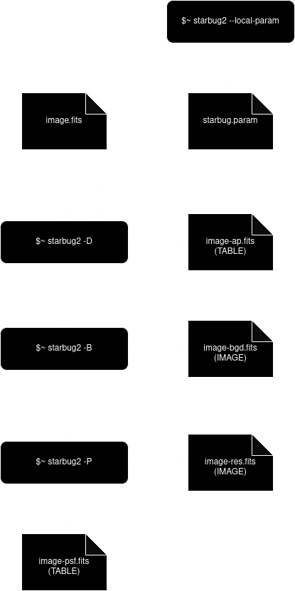

*************
A Typical Run
*************

::

    $~ starbug2 --local-param
    $~ starbug2 -vD mosaic.fits
    $~ starbug2 -d mosaic-ap.fits -BP dither1.fits dither2.fits dither3.fits

    $~ starbug2-match -Gv -s MATH_THRESH=0.3 dither{1,2,3}-psf.fits -o final.fits

