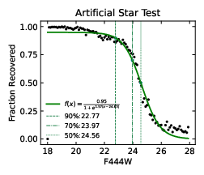

***********************
Artificial Star Testing
***********************

Artificial Star Testing (AST) is the injection of known model PSFs into an image and determining the quality of the detection and flux recovery of the routine. *Starbug2* has a separate executable called :code:`starbug2-ast` to conduct artificial star testing.

The AST routine operates on an image and injects *NSTARS* with known brightnesses from the range *MAG_MIN* - *MAG_MAX* onto the array, runs the :doc:`detection <./detection>`, :doc:`background estimation <./background>` and :doc:`PSF photometry <./psf>` routine, and reports the resulting measured flux (if detected). This process runs *NTESTS* times, building a large catalogue of detection rate and uncertainty as a function of input brightness.

The idea is to test the quality of the parameter file and photometric routines on a set of images. It is important that you use exactly the same parameters or parameter file in these tests as has been used in the photometric processing. This is loaded in with :code:`starbug2-ast --param file.param`.

Output
------

The output is in the form as a multi extension fits file, with the following extensions:

AST : TABLE
    The first extension is the compiled user facing results. This is a table with detections rate "*rec*" and error "*err*" and a function of input magnitude "*mag*". The error column is calculated as the standard deviation of the flux measurements within the magnitude bin. 

RAW : TABLE
    The raw injected source data.

CMP : IMAGE (in prep.)
    An image with the same dimensions as the working input image, with the detection rate fraction as a function of pixel coordinate.

If the parameter *PLOTAST* is specified, the AST table will be compiled into a readable figure, showing the detection rate decay as a function of magnitude and overlaying the 90%, 70% and 50% completeness magnitude. The routine fits an "s-curve" to the completeness decay, with the following formula, the parameters *l*, *k*, :math:`x_0` are given in the header file of the AST table.

.. math::

   f(x)=\frac{l}{1+e^{-k(x-x_0)}}

Usage
-----

Usage of :code:`starbug2-ast` can be shown with::

    $~ starbug2-ast -vh

    StarbugII Artificial Star Testing
    usage: starbug2-ast [-vh] .[-N ntests] [-n ncores] [-p file.param] [-S nstars] [-s opt=val] image.fits
        -h  --help          : show help screen
        -N  --ntests    num : number of tests to run
        -n  --ncores  cores : number of cores to split the tests over
        -o  --output output : output directory or filename to export results to
        -p  --param    file : load a parameter file
        -S  --nstars    num : number of stars to inject per test
        -s  --set    option : set parameter at runtime with syntax "-s KEY=VALUE"
        -v  --verbose       : show verbose stdout output

A typical run, parallelised over three cores, and outputting all results, may look like::

    $~ starbug2-ast -N3000 -S100 -n3 -v -p file.param -sPLOTAST=ast.pdf image.fits

Relevant Parameters
-------------------

NTESTS 
    The number of individual tests to run.

NSTARS
    The number of artificial stars to inject into an image on a single run. This number should be considered carefully. Too low and the user will be required to run many tests to get a reliable result, however too high and it will begin to lead to artificial contamination in the image and introduce error. A good rule of thumb is to stay below ~10% of the number of stars in the image.

SUBIMAGE 
    in prep.

MAX_MAG 
    The bright magnitude limit of stars to inject. This number should be similar or slightly higher than the brightest star in the raw image. Too low and useful information about the uncertainty on bright fluxes will not be gathered, too high and the tests will take longer to run.

MIN_MAG
    The faint magnitude limit of stars to inject. AST will inject stars uniformly between *MAX_MAG* and *MIN_MAG*. This number should be slightly fainter than the faintest detected source in the image.

PLOTAST
    Optional figure output. This is the filename of a simple user facing result. If left empty, the routine will not output this image.

