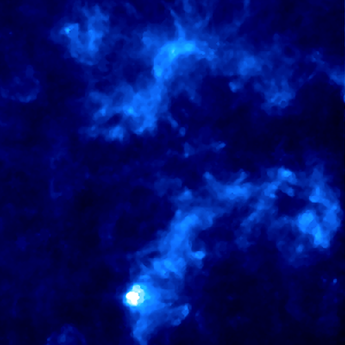

**************************************
Diffuse Background Estimation
**************************************

The diffuse background emission estimation routine tries to decouple the components of flux in the image produced by diffuse emission and point sources.

.. note::
    From here on, "Diffuse background emissions" are known as "background emissions". This is not to be confused with the "background emission" noise in the image, produced by the instruments. Measuring this noise is not a process *starbug2* does.

The background estimation routine is called with the :code:`-B` or :code:`--background` flags. This will create an image fits file the same shape as the input image, with the suffix :code:`-bgd` appended to the filename. This image will contain the estimated background emissions with the same pixel flux unit as the input image.
In the example below, the left image shows a dusty raw input image into the routine, the right shows an estimated background result.

The routine combines an aperture masking and unsharp masking steps. The masked apertures are scaled with the flux of the source, such that brighter (larger on the detector) sources require wider apertures. These aperture radius for a given source *i* is calculated with:

.. math::
   
   R_i = A\sigma\(ln(\frac{f_i}{s_i})\)^B

Where *A* is a dimensionless scale factor, :math:`\sigma` is the full width half maximum of the PSF of the source, :math:`f_i` and :math:`s_i` are the source flux and sky values respectively and *B* is the profile slope.

The routine requires a source list to be loaded using :code:`-d sourcelist.fits` or generated with the :doc:`detection routine <./detection>`. Running the routine looks something like::

    $starbug2 -vd image-ap.fits -B image.fits

Relevant Parameters
-------------------

BGD_R
    The routine will mask stars using varying aperture sizes which it attempts to calculate. Sometimes this will produce a suboptimal result. If you are unhappy with the default variable aperture masking, set a constant aperture mask radius in pixel units with this parameter. 

    The exact performance of the routine is difficult to measure in isolation. You may look at the resulting image and think it looks good, but find in the later PSF photometry, that *starbug2* over or under subtracts the PSF. This may be due to a bad background estimation. Try altering this value and rerunning the PSF routine to see if you can change the outcome. 

PROF_SCALE
    Aperture mask profile scaling factor. This is *A* in the above equation. 

PROF_SLOPE
    Aperture mask profile exponent. This is *B* in the above equation.

BGD_CHECKFILE
    An output ds9 region file, containing the aperture to be masked for every source in the source list. This can be loaded into ds9 to inspect the resulting mask profiles, if left blank, it will not output this file.

BOX_SIZE
    There will be a kernel passed over the image to build the 2D image of the background. This parameter sets the width of that kernel in pixel units. By default this is set low, which will result in a high resolution estimation of the background, but may be susceptible to bright features or noise in the image. Widening the kernel will result in a more "fuzzy" estimation but will smooth over the noise. Both approaches are appropriate in different situations.

AP_FILE 
    Set the source list to be loaded into the background routine. Synonymous with :code:`-d sourcelist.fits`.
